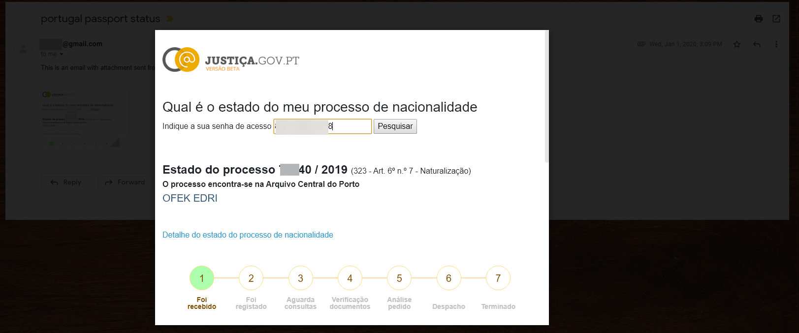

## check portugal visa status
  
  
  
   
1. copy env.sh.example to env.sh.
2. edit env.sh with the following vars:  
subject = "" #Email subject  
body = "This is an email with attachment sent from Python" #Body text  
sender_email = ""  
receiver_email = "" #  
password = "" #Password for sender account  
3. load env.sh by running:
source env.sh

## Build
docker build . -t check_portugal_visa_status:latest

## Run 
#Reminder: run source env.sh to load vars  

docker run \
-e subject="${subject}" \
-e body="${body}" \
-e sender_email="${sender_email}" \
-e receiver_email="${receiver_email}" \
-e password="${password}" \
-e passport_request_id="${passport_request_id}" \
--rm check_portugal_visa_status

